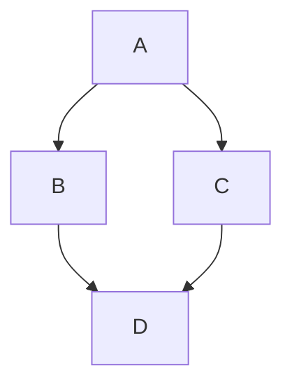

# Markdown Expert

## Overview

Use this skill to create, format, and debug Markdown documents. It covers GitHub Flavored Markdown (GFM), CommonMark, and Pandoc, along with tools for linting and formatting.

## Best Practices

- **Headings:** Use ATX style (`# Heading`) instead of Setext (`Heading\n===`). Limit to 3 levels.
- **Lists:** Use hyphens `-` for unordered lists.
- **Code Blocks:** Always specify the language in fenced code blocks (e.g., ` ```python `).
- **Line Length:** Wrap text at 80 characters for readability (unless using a renderer that doesn't support soft breaks, but GFM does).
- **Formatting:** Use `prettier` for automatic formatting.
- **Linting:** Use `markdownlint` to catch structure and style issues.

## Flavors & Syntax

Different platforms use different Markdown "flavors".

- **GFM (GitHub):** The standard for developers. Supports tables, task lists, strikethrough.
- **CommonMark:** The strictly standardized base.
- **Pandoc:** Extended features for document conversion (citations, definition lists).
- **Reference:** See `references/flavors.md` for specific syntax comparisons.

## Advanced Features

### Mermaid Diagrams
Embed diagrams directly in Markdown.



### Tables (GFM)
```markdown
| Header 1 | Header 2 |
| :------- | :------- |
| Cell 1   | Cell 2   |
```

### Frontmatter
Use YAML frontmatter for metadata at the top of the file.

```yaml
---
title: My Document
date: 2024-01-01
tags: [markdown, guide]
---
```

- **Reference:** See `references/advanced.md` for detailed examples of diagrams, footnotes, and math.