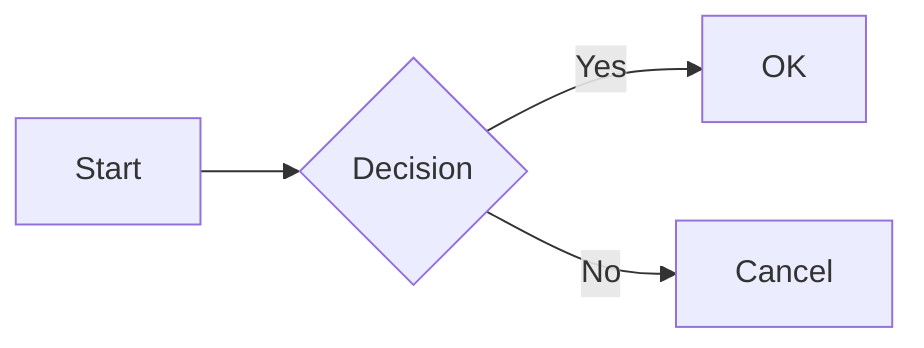
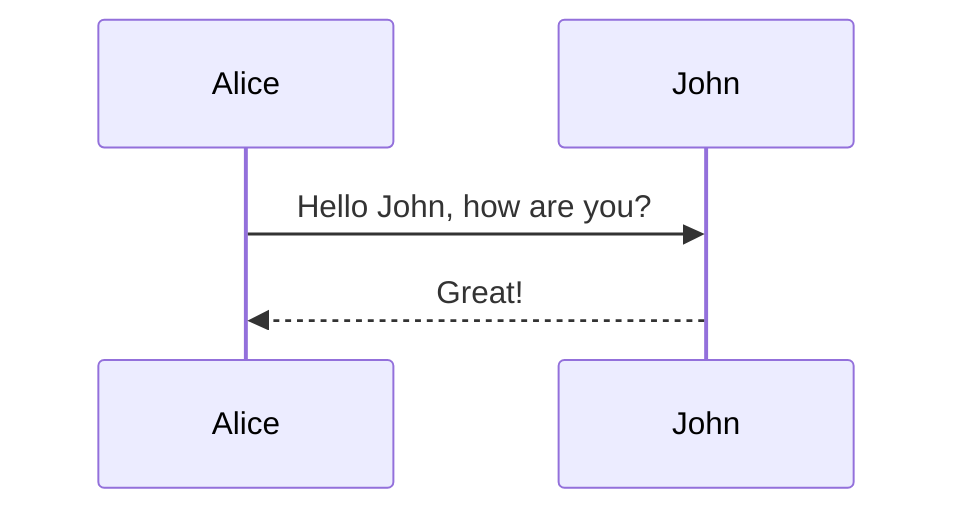

# Advanced Markdown Features

## Mermaid Diagrams

Render flowcharts, sequence diagrams, Gantt charts, etc.

### Flowchart


### Sequence Diagram


## Footnotes (GFM/Pandoc)

A note[^1] in the text.

[^1]: The footnote text.

## Math (GitHub/Pandoc)

GitHub now supports MathJax in Markdown.

- **Inline:** $x^2 + y^2 = z^2$
- **Block:**
$$
\sum_{i=1}^n i = \frac{n(n+1)}{2}
$$

## HTML Embedding

You can mix HTML for things Markdown doesn't support (e.g., centering, specific image sizing).

```html

<p align="center">Centered text</p>
```
