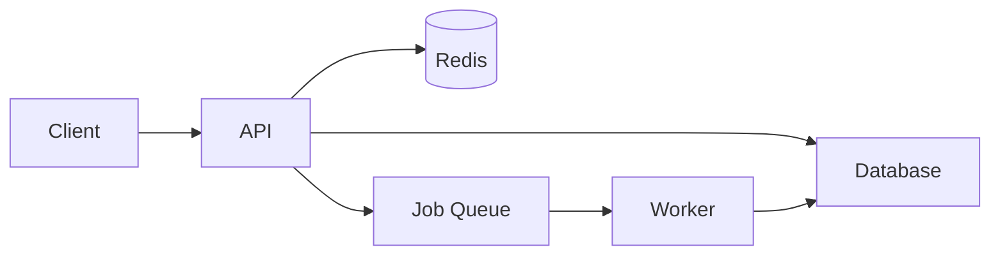

# Architecture Patterns Reference

## Request/Response Lifecycle (Web APIs)

### REST API (Express / FastAPI / Rails / Django REST)
```
HTTP Request
    → Router (match URL + method)
    → Middleware (auth, logging, rate limit, CORS)
    → Controller/Handler (parse request, validate input)
    → Service/Business Logic (process, enforce rules)
    → Repository/ORM (read/write database)
    → Response (serialize, return HTTP)
```

### GraphQL
```
HTTP POST /graphql
    → Schema validation (type checking)
    → Resolver chain (each field resolves independently)
    → DataLoader (batch N+1 queries)
    → Data sources (DB, REST APIs, cache)
    → Response (JSON)
```

### tRPC (TypeScript full-stack)
```
Client calls procedure
    → tRPC router (type-safe routing)
    → Input validation (Zod schema)
    → Procedure handler
    → Data layer
    → Type-safe response
```

---

## Data Flow Patterns

### CRUD Application
- Mostly direct DB reads/writes
- Business logic thin — validation + persistence
- Look for: ORM models, migrations, serializers

### Event-Driven
- Components communicate via events/messages
- Look for: event emitters, message queues (RabbitMQ, Kafka, SQS), pub/sub patterns
- Key files: event handlers, message producers/consumers

### CQRS (Command Query Responsibility Segregation)
- Separate read and write models
- Look for: `commands/`, `queries/`, separate read/write stores

### Repository Pattern
- Data access abstracted behind interfaces
- Look for: `repositories/`, `daos/`, interface files with multiple implementations

---

## Authentication Patterns

### JWT (stateless)
- Token issued on login, verified on each request
- Look for: JWT library (jsonwebtoken, PyJWT), middleware that checks Authorization header

### Session-based (stateful)
- Server stores session, client gets session cookie
- Look for: session store (Redis, DB), cookie-parser, session middleware

### OAuth2 / SSO
- Look for: passport.js, authlib, OmniAuth, Keycloak configs

### API Keys
- Look for: API key table in DB, key validation middleware

---

## Caching Patterns
- **In-memory cache:** Variables, LRU cache (functools.lru_cache, node-cache)
- **Distributed cache:** Redis, Memcached
- Look for: cache keys, TTL values, cache invalidation logic

---

## Queue / Background Jobs
- **Celery (Python):** `@app.task`, `delay()`, `apply_async()`
- **Bull/BullMQ (Node):** Queue definitions, job processors
- **Sidekiq (Ruby):** `perform_async`, worker classes
- Look for: `workers/`, `jobs/`, `tasks/` directories

---

## How to Draw an Architecture Diagram

For a standard report, include an ASCII diagram like:

```
┌─────────────┐       ┌──────────────┐       ┌────────────┐
│   Client    │──────▶│   API Layer  │──────▶│  Database  │
│ (React SPA) │       │  (Express)   │       │ (Postgres) │
└─────────────┘       └──────┬───────┘       └────────────┘
                             │
                    ┌────────▼────────┐
                    │  Redis Cache    │
                    └─────────────────┘
```

Or Mermaid (renders in GitHub):



---

## Red Flags in Architecture

- **God objects:** Single class/file doing everything (>1000 lines often a sign)
- **Circular dependencies:** Module A imports B which imports A
- **Missing abstraction:** Direct DB calls scattered throughout — no service/repository layer
- **Sync blocking operations** in async code paths
- **No separation of concerns:** Business logic mixed with HTTP handling
- **Hardcoded configuration** instead of environment-based
- **Missing error boundaries:** No centralized error handling
